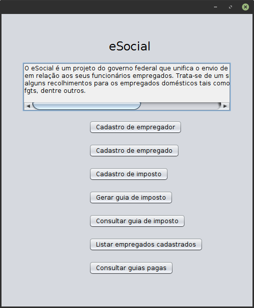

# eSocial Simplified
*Tax collecting app built with Swing*

eSocial is a federal government project that unifies the sending of information
by the employer with respect to its employees. **This project is a simulation
of the official eSocial.**

You can watch a video demo [here]() (TO DO).

This project was built for a class assignment during my Bachelor's Degree in
Computer Science on November, 2018.

Thanks to my colleague [Izadora](), whom participated in the project.

## How to run the app
You'll need to install [NetBeans](https://netbeans.apache.org/download/index.html)
IDE and [JDK 8](https://www.oracle.com/technetwork/java/javase/downloads/jdk8-downloads-2133151.html)
to run the project.

## License
Read about license rights and limitations [here](LICENSE).
